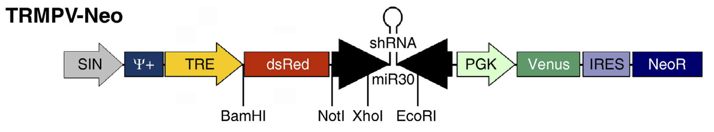
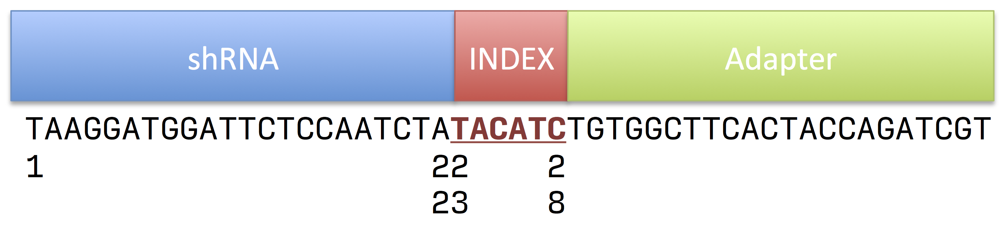

# Pooled RNAi pipeline

## Intro

While most next generation sequencing analysis pipelines require the data to be mapped to the target genome there are some pipelines that can be done without any alignment step. Once such problem is the analysis of pooled shRNA experiments such as in *Zuber, et. al, 2011*[^Zuber2011]

In this experiment a library of hairpins is introduced into a population of cells and depending on which hairpin gets encorporated that particular cell my grow or die. By sequencing using primers specific to the hairpin contructs you can determine which shRNA lead to proliferation and survival or arrest. 

## Sequence design

A typical shRNA construct will look as follows;

For this excercise we will focus on a core region that contains the following sequence elements:

The shRNA sequence goes from position 1 to 22. There is an index sequence that for this example is fixed and is from position 23 to 28 and then an adapter sequence. 

Given a FASTQ file of sequences we want to count the abundance of the shRNA sequences which. shRNA's with higher abudances may indicate that the gene targeted by them potentially responsible for limited cell proliferation (i.e., repression them turns growth on)

## Pipeline

* Quality Trim to make sure we have high enough Q's at the adapter region: 
	* trim to 30, min length L

* Convert from FASTQ->FASTA
	
* Clip Adapter; discard sequnces without an adapter (quality control)

* Trim sequence to extract shRNA part (m-->k)

* Collapse (counts)

* Tabular

* Join (advanced program in R, Python, Perl)

## References

[^Zuber2011]: Toolkit for evaluating genes required for proliferation and survival using tetracycline-regulated RNAi. Nat Biotechnol. 2011 Jan; **29**(1): 79–83. [PMC3394154](http://www.ncbi.nlm.nih.gov/pmc/articles/PMC3394154/)

